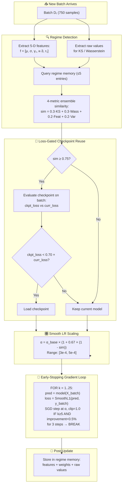
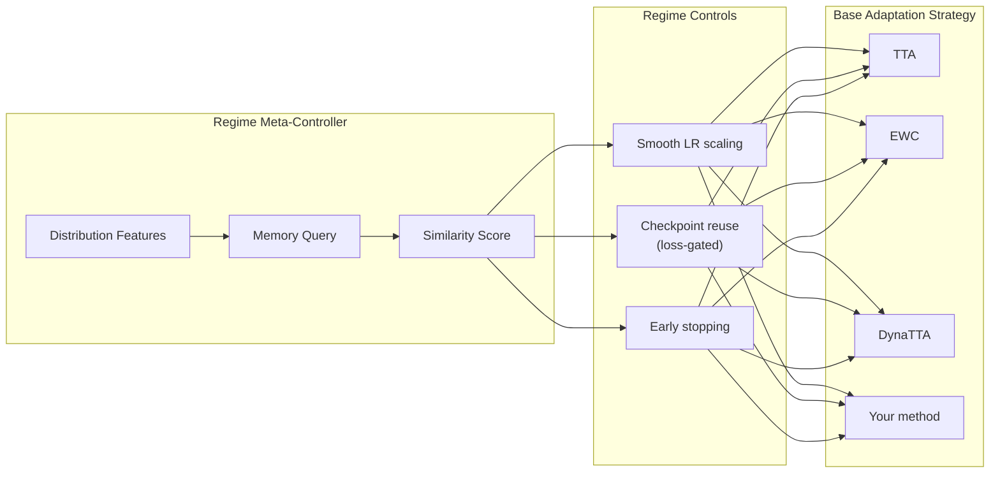
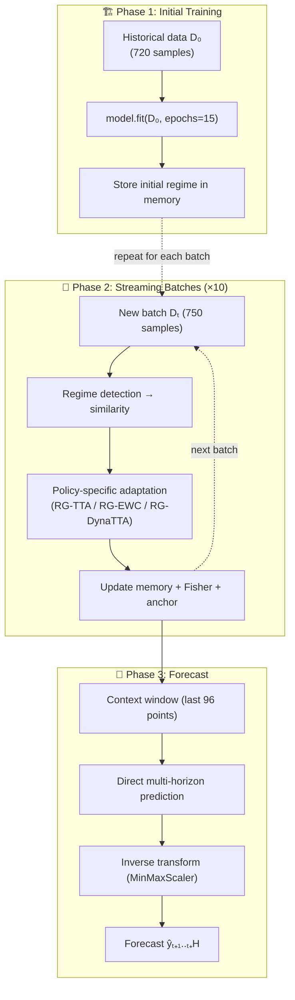

# RG-TTA: Regime-Guided Test-Time Adaptation for Streaming Time Series Forecasting

[](https://www.python.org/downloads/)
[](LICENSE)

## Table of Contents

1. [Overview](#overview)
2. [Core Thesis](#core-thesis)
3. [Similarity Metric](#similarity-metric)
4. [Update Policies](#update-policies)
5. [Architecture Flow Diagrams](#architecture-flow-diagrams)
6. [Model Architectures](#model-architectures)
7. [Data Pipeline](#data-pipeline)
8. [Datasets](#datasets)
9. [Experimental Design](#experimental-design)
10. [Training and Stability](#training-and-stability)
11. [Theoretical Foundations](#theoretical-foundations)
12. [Results](#results)
13. [Design Decisions](#design-decisions)
14. [Reproduction](#reproduction)
15. [Project Structure](#project-structure)
16. [References](#references)

---

## 1. Overview

**RG-TTA** (Regime-Guided Test-Time Adaptation) uses distributional regime similarity as a *meta-controller* for test-time adaptation intensity. When new streaming data arrives in batches, RG-TTA measures how similar the current distribution is to previously seen regimes and **continuously modulates** its adaptation strategy:

- **Learning rate** scales smoothly with distributional novelty: `α = α_base × (1 + γ × (1 - sim))`, where `γ = 0.67`
- **Checkpoint reuse** is loss-gated: stored specialist models are loaded only when `sim ≥ 0.75` *and* checkpoint loss `< 0.70 × current loss` (≥30% improvement required)
- **Step count** is determined by loss-driven early stopping (patience=3, ε=0.005), up to a maximum of 25 steps

The contribution is **not** a new model architecture — it is a **when-to-adapt and how-aggressively** strategy that wraps any neural forecaster exposing `train/predict/save/load` interfaces.

**Headline result (672 experiments):** Regime-guided policies win **156 of 224** seed-averaged experiments (**69.6%**). RG-EWC reduces MSE by 14.1% vs standalone EWC (75.4% win rate). RG-TTA reduces MSE by 5.7% vs TTA while running 5.5% *faster* thanks to early stopping.

---

## 2. Core Thesis

When streaming time-series data arrives in batches, measuring distributional similarity to previously-seen regimes and using that similarity to *continuously control adaptation intensity* yields better accuracy and robustness than fixed-strategy baselines. Specifically:

1. **Recurring regimes**: checkpoint reuse (specialist model) beats continuous adaptation (generalist model). On `synth_recurring`, RG-TTA achieves **100% win rate** vs all baselines.
2. **Smooth/stationary data**: regime-guided adaptation is at least as accurate as TTA, and often faster due to early stopping on already-familiar batches.
3. **Novel distribution shocks**: aggressive adaptation (high LR from low similarity) + EWC regularisation preserves old knowledge while adapting to genuine shocks.

### Why Specialist > Generalist on Recurring Data

A specialist checkpoint trained on regime A data minimises the regime-specific risk. A generalist trained on all data minimises the mixture objective across regimes A, B, C, etc. When regime A recurs, the specialist incurs zero bias on A while the generalist must compromise across regimes. The expected excess risk of the generalist on A is bounded by the inter-regime distributional divergence. (See paper §4 Theorem 1 for the formal error bound, and §8 Proposition 3 for the specialist advantage.)

---

## 3. Similarity Metric

RG-TTA uses an ensemble of 4 complementary distributional similarity methods.

### 3.1 Distribution Feature Vector (5-D)

For a batch of values **v** = [v₁, ..., vₙ]:

**f = [μ, σ, γ₁, κ-3, r₁]**

| Feature | Formula | Captures |
|---------|---------|----------|
| Mean | μ = (1/N) Σvᵢ | Level |
| Std | σ = std(v) + 1e-8 | Scale |
| Skewness | γ₁ = (1/N) Σ((vᵢ - μ)/σ)³ | Asymmetry |
| Excess kurtosis | κ-3 = (1/N) Σ((vᵢ - μ)/σ)⁴ - 3 | Tail heaviness |
| Lag-1 autocorrelation | r₁ = corrcoef(v₁:ₙ₋₁, v₂:ₙ)[0,1] | Temporal structure |

### 3.2 Four-Method Ensemble

**Feature distance similarity:**

    feat_sim = 1 / (1 + ‖q - s‖₂ / ((‖q‖₂ + ‖s‖₂)/2 + ε))

**Kolmogorov-Smirnov similarity** (on raw values):

    ks_sim = 1 - Dₙ,  where Dₙ = sup_x |F_q(x) - F_s(x)|

**Wasserstein-1 similarity** (on raw values):

    wass_sim = 1 / (1 + W₁(q_raw, s_raw) / max(ptp(q_raw), ptp(s_raw), ε))

**Variance ratio** (catches volatility regime shifts):

    var_sim = min(σ_q, σ_s) / max(σ_q, σ_s)

**Weighted ensemble:**

    sim = 0.3 · ks_sim + 0.3 · wass_sim + 0.2 · feat_sim + 0.2 · var_sim

The statistical tests (KS, Wasserstein) receive equal weight (0.3 each) as they use the full empirical distribution. The feature vector (0.2) captures higher-order moments. The variance ratio (0.2) specifically detects volatility regime shifts where location is unchanged but spread differs — a blind spot for KS/Wasserstein when the mean dominates.

---

## 4. Update Policies

All 6 policies use the **same base model** per experiment. Only the update strategy differs.

### Why These 6 Policies?

The 6 policies form a **controlled ablation** that isolates exactly what regime-guidance contributes. Each baseline has a matched RG-variant that differs *only* in adding the regime-guidance layer.

#### The Baselines (Policies 1–3): "What already exists?"

| Policy | Research Question | Why Include It? |
|--------|------------------|-----------------|
| **TTA** | *What happens with fixed-intensity adaptation?* | The simplest reasonable online strategy — 20 gradient steps, same intensity every time. This is the "one-size-fits-all" baseline that RG-TTA directly improves upon. |
| **EWC** | *Does preventing forgetting help?* | EWC (Kirkpatrick et al., 2017) is the most-cited continual learning regulariser. It adds a Fisher-weighted penalty to prevent catastrophic forgetting during adaptation. |
| **DynaTTA** | *Does dynamically adjusting the learning rate help?* | DynaTTA (Grover & Etemad, 2025) uses shift metrics (z-score, embedding distances) to scale the LR via a sigmoid. It's the closest existing work to our idea — it adapts *how aggressively* to update, but reactively rather than proactively. |

#### Our Contributions (Policies 4–6): "What does regime-guidance add?"

| Policy | Research Question | Why Include It? |
|--------|------------------|-----------------|
| **RG-TTA** | *Does regime-guided adaptation beat fixed or reactive adaptation?* | Core contribution. Tests whether continuously modulating LR based on distributional similarity, combined with loss-gated checkpoint reuse and early stopping, outperforms one-size-fits-all (TTA) and reactive (DynaTTA) strategies. |
| **RG-EWC** | *Does combining regime-guidance with EWC improve both?* | Tests whether EWC's forgetting protection benefits from regime-guided LR and checkpoint reuse. If RG-EWC beats both standalone EWC and standalone RG-TTA, the combination is synergistic. |
| **RG-DynaTTA** | *Does combining proactive + reactive adaptation help?* | Tests whether the "best of both worlds" — proactive regime detection (RG-TTA) + reactive error-based LR (DynaTTA) — yields additional gains. Demonstrates RG-TTA as a **composable wrapper**. |

#### The Ablation Logic

The 6 policies form a clean hierarchy:

```
TTA                              → fixed adaptation (cheap, naive)
EWC                              → TTA + forgetting protection
DynaTTA                          → TTA + dynamic LR (reactive, no regime awareness)
RG-TTA                           → TTA + regime-guided LR + checkpoints + early stopping
RG-EWC                           → RG-TTA + EWC regularisation
RG-DynaTTA                       → RG-TTA + DynaTTA sigmoid LR (proactive + reactive)
```

Key comparisons:
- **RG-TTA vs TTA** → Does regime-guidance help? (core claim) → **Yes: -5.7% MSE, 67% wins**
- **RG-EWC vs EWC** → Does regime-guided EWC beat always-on EWC? → **Yes: -14.1% MSE, 75.4% wins**
- **RG-DynaTTA vs DynaTTA** → Does adding regime-awareness improve DynaTTA? → **Yes: -3.8% median MSE, 62.1% wins**

> **Note on calibration-only methods (TAFAS, Kim et al., AAAI 2025):** TAFAS freezes the source model and uses Gated Calibration Modules (GCMs) to adapt predictions without weight updates. It is strong at short horizons (H≤192) but collapses at longer horizons (H=336/720, +100–400% vs TTA). Since our study spans H∈{96,192,336,720}, we exclude TAFAS from the primary 6-policy comparison. Implementation files are retained in the repo for reference.

---

### 4.1 Policy 1: TTA (Test-Time Adaptation)

Fixed-step gradient adaptation on new data. Cheapest meaningful baseline.

**What happens per batch:**

```
1. Keep current model θ (no checkpoint load, no re-initialisation)
2. Freeze backbone; only output_projection is trainable
3. Prepare sequences from new_batch + recent history
4. FOR k = 1..20:
       pred = model(X_batch)
       loss = SmoothL1(pred, y_batch)
       loss.backward()
       clip_grad(1.0)
       optimizer.step()                        // Adam, lr=3e-4
```

**When TTA wins:** On continuously drifting data without recurrence (e.g., Weather), where fixed consistent adaptation is optimal — there's no regime to reuse, so the overhead of regime detection adds nothing. TTA wins Weather (MSE 138.99 vs RG-TTA 145.21).

**When TTA fails:** On distribution shocks, 20 fixed steps at moderate LR may be insufficient. On recurring regimes, it wastes effort re-learning what a checkpoint already knows.

| Parameter | Value |
|-----------|-------|
| Steps K | 20 (fixed) |
| Learning rate α | 3 × 10⁻⁴ |
| Optimizer | Adam (β₁=0.9, β₂=0.999) |
| Gradient clip | 1.0 |
| Backbone | Frozen (output_projection only) |

### 4.2 Policy 2: EWC (Elastic Weight Consolidation)

Kirkpatrick et al., 2017. Penalises changes to parameters important for previous tasks via diagonal Fisher Information Matrix.

**What happens per batch:**

```
1. Keep current model θ (no checkpoint load)
2. Freeze backbone; only output_projection is trainable
3. FOR k = 1..15:
       pred = model(X_batch)
       L_task = SmoothL1(pred, y_batch)
       L_ewc  = (λ/2) · Σᵢ Fᵢ · (θᵢ - θ*ᵢ)²   // Fisher-weighted penalty
       loss   = L_task + L_ewc
       loss.backward()
       clip_grad(1.0)
       optimizer.step()
4. Update Fisher: F⁽ᵗ⁾ = 0.5·F⁽ᵗ⁻¹⁾ + 0.5·F_new    // running average
5. Update anchor: θ* ← current θ
```

**Key design choices:**
- **Online Fisher** (running average): Simpler than storing per-task Fisher matrices; works well for streaming data.
- **Fisher clamping** to [0, 10⁴]: Prevents numerical instability from large gradient outliers.
- **λ = 400**: Tuned to balance plasticity vs stability.

| Parameter | Value |
|-----------|-------|
| Steps K | 15 (fixed) |
| Learning rate α | 3 × 10⁻⁴ |
| λ (EWC penalty) | 400.0 |
| Fisher samples | 200 |
| Fisher clamp | [0, 10⁴] |
| Online Fisher decay | 0.5 |

### 4.3 Policy 3: DynaTTA (Dynamic Test-Time Adaptation)

Grover & Etemad, 2025. Dynamic learning rate computed via sigmoid transformation of 3 shift metrics.

**What happens per batch:**

```
1. Keep current model θ
2. Freeze backbone; only output_projection is trainable
3. Compute 3 shift metrics from new_batch:
       z  = prediction-error z-score (how unusual is this batch?)
       d_r = RTAB embedding distance (drift from recent representations)
       d_p = RDB embedding distance (drift from representative set)
4. Z-normalise each → composite score S → sigmoid → dynamic LR αₜ
5. FOR k = 1..20:
       SGD step at αₜ, clip=1.0
6. Update RTAB/RDB embedding buffers with post-adaptation embeddings
```

**How RG-TTA differs from DynaTTA:**
- DynaTTA is **reactive** (adjusts LR based on *current* error/drift signals)
- RG-TTA is **proactive** (matches distributions to *historical* regimes before seeing errors)
- RG-DynaTTA combines both: proactive checkpoint reuse + reactive LR tuning

**DynaTTA EMA convergence note:** DynaTTA's published EMA smoothing coefficient (η=0.1) requires ~22 gradient steps to converge — a design suited to 500-window sliding-window evaluation. Under our 10-batch streaming protocol, the EMA never fully converges, leaving the dynamic LR below TTA's fixed rate for the first 5-6 batches. Our implementation reproduces DynaTTA faithfully with published hyperparameters; this is a protocol-level mismatch.

| Parameter | Value |
|-----------|-------|
| Steps K | 20 (fixed) |
| α_min / α_max | 10⁻⁴ / 10⁻³ |
| κ (sigmoid steepness) | 1.0 |
| η (EMA rate) | 0.1 |
| RTAB size | 360 |
| RDB size | 100 |

### 4.4 Policy 4: RG-TTA — Regime-Guided TTA *(ours)*

Continuous regime-guided adaptation with similarity-scaled LR, loss-gated checkpoint reuse, and loss-driven early stopping. This is our **core contribution**.

**Algorithm (v2 — continuous adaptation):**

```
1. f ← distribution_features(batch.y)         // 5-D: [μ, σ, γ₁, κ-3, r₁]
2. (sim, ckpt) ← memory.query(f, batch.y)     // 4-method ensemble (KS + Wass + Feat + VarRatio)

3. // Loss-gated checkpoint reuse
   IF sim ≥ 0.75:
       ckpt_loss ← eval(ckpt, batch)          // forward pass with stored checkpoint
       curr_loss ← eval(model, batch)          // forward pass with current model
       IF ckpt_loss < 0.70 × curr_loss:        // loss gate: ≥30% improvement required
           model.load(ckpt)                    // checkpoint reuse

4. // Similarity-scaled learning rate
   α ← α_base × (1 + γ × (1 - sim))          // α_base=3e-4, γ=0.67
   // sim=1.0 → α=3e-4 (conservative)
   // sim=0.5 → α≈4e-4 (moderate)
   // sim=0.0 → α≈5e-4 (aggressive)

5. // Loss-driven early stopping
   freeze_backbone(model)
   patience ← 0
   FOR k = 1..K_max (25):
       pred = model(X_batch)
       loss = SmoothL1(pred, y_batch)
       loss.backward(); clip_grad(1.0); optimizer.step()
       IF k ≥ K_min (5) AND relative_improvement < ε (0.005):
           patience += 1
           IF patience ≥ 3: BREAK              // early stop: loss converged
       ELSE: patience ← 0

6. memory.store(f, model.state_dict, batch.y)
```

**Key hyperparameters:**

| Parameter | Value | Rationale |
|-----------|-------|-----------|
| α_base | 3 × 10⁻⁴ | Matches TTA's default LR |
| γ (LR similarity scale) | 0.67 | At sim=0, LR is 1.67× base |
| K_max | 25 | Maximum gradient steps |
| K_min | 5 | Minimum before early stopping |
| Patience | 3 | Consecutive steps below ε |
| ε (min relative improvement) | 0.005 | 0.5% improvement threshold |
| Checkpoint threshold | sim ≥ 0.75 | When to consider loading |
| Loss gate | < 0.70 × current | ≥30% improvement required |
| Memory capacity | 5 (FIFO eviction) | Cap on stored checkpoints |

**Why v2 (continuous) replaced v1 (discrete tiers):**

v1 used three fixed tiers: HIGH (sim≥0.85, K=10), MID (0.55≤sim<0.85, K=20), LOW (sim<0.55, K=30). This had two problems: (1) hard thresholds caused discontinuities — a batch at sim=0.849 got 20 steps while sim=0.851 got 10, despite near-identical distributions; (2) fixed step counts couldn't adapt to batch difficulty. v2 replaces this with continuous LR scaling and loss-driven early stopping, which naturally allocates more effort to difficult batches and less to easy ones. In practice, the step distribution is bimodal: 49% of batches use the full 25-step budget (novel regimes) while 12% converge in ≤8 steps (familiar regimes), averaging 18.5 steps per batch (median 24) vs TTA's fixed 20, saving 5.5% wall-clock time.

**Why it works — the core insight:** When a high-similarity match is found and passes the loss gate, loading the specialist checkpoint provides a starting point that is already calibrated for the current distribution. A few gradient steps from a good starting point beats many steps from a mediocre one. The loss gate prevents reverting to stale checkpoints on slowly-drifting data.

**When RG-TTA wins:**
- **Recurring regimes** (ETTh1/ETTh2 seasonal patterns, synth_recurring): checkpoint reuse is more accurate than blind TTA — 100% win rate on synth_recurring, 88% on ETTh2
- **Mixed scenarios** (some batches novel, some recurring): smooth LR scaling allocates gradient budget where needed
- **Accuracy at lower cost**: RG-TTA is 5.5% faster than TTA (126.9s vs 134.3s) thanks to early stopping

**When RG-TTA can struggle:**
- **Continuously drifting data without recurrence** (Weather): memory never gets useful matches, RG-TTA degrades to similarity-modulated TTA with slight overhead. TTA wins Weather by 4.5%.
- **Volatility-only shifts** (synth_volatility): checkpoint reuse doesn't help when variance changes but temporal dynamics are the same. Only 6% win rate.
- **Short streams** (<5 batches): memory too sparse for effective matching.
- **Random-walk data** (Exchange): near-zero regime recurrence, all policies perform identically (~0.01 MSE).

### 4.5 Policy 5: RG-EWC — Regime-Guided EWC *(ours)*

RG-TTA with EWC regularisation (λ=400). The adaptation loop adds a Fisher-weighted penalty term.

**Algorithm:**

```
1. Run regime detection + checkpoint loading (same as §4.4 steps 1-3)
2. IF checkpoint loaded: reset EWC anchor θ* ← loaded checkpoint params
3. α ← α_base × (1 + γ × (1 - sim))          // same smooth LR
4. FOR k = 1..K_max (with early stopping):
       pred = model(X_batch)
       L_task = SmoothL1(pred, y_batch)
       L_ewc  = (λ/2) · Σᵢ Fᵢ · (θᵢ - θ*ᵢ)²  // λ = 400, flat
       L_total = L_task + L_ewc
       L_total.backward(); clip_grad(1.0); optimizer.step()
5. memory.store(f, model.state_dict, batch.y)
6. Fisher update: F⁽ᵗ⁾ = 0.5 · F⁽ᵗ⁻¹⁾ + 0.5 · F_new
7. anchor θ* ← current θ
```

**Key design choices:**
- **Flat λ=400** (not tier-modulated): v1 used tier-modulated EWC scales (HIGH=0.5, MID=1.0, LOW=1.5). v2 uses a flat λ=400 because the continuous LR scaling already modulates adaptation intensity — adding tier-dependent EWC scales introduced unnecessary complexity without measurable benefit.
- **Anchor reset on checkpoint load**: When a checkpoint is loaded, the EWC anchor θ* is reset to the loaded parameters. Without this, EWC would penalise movement away from the *pre-load* state, which defeats the purpose of checkpoint reuse.

**Result:** RG-EWC is the **strongest single policy**, winning 68/224 experiments (30.4%). It reduces MSE by 14.1% vs standalone EWC with a 75.4% win rate in head-to-head comparisons (169/224).

### 4.6 Policy 6: RG-DynaTTA — Two-Level Controller *(ours)*

Combines **proactive** regime detection (RG-TTA's checkpoint reuse + early stopping) with **reactive** shift-magnitude sensing (DynaTTA's sigmoid LR). Instead of the similarity-based smooth LR, DynaTTA's formula computes the learning rate based on prediction-error z-score and embedding distances.

**Two-level controller:**

| Level | Controller | Decides | Based On |
|-------|-----------|---------|----------|
| **Strategic** | RG-TTA | Checkpoint reuse, early stopping | Historical regime similarity (proactive) |
| **Tactical** | DynaTTA | Learning rate α_t | Current prediction error + embedding drift (reactive) |

**When RG-DynaTTA wins:** On heterogeneous streams with varying shift magnitudes. DynaTTA's sigmoid responds to *how different* the shift is, while RG-TTA's checkpoints handle recurrence.

**Result:** RG-DynaTTA wins 23/224 experiments (10.3%). It has +0.5% average MSE vs DynaTTA (skewed by synthetic outliers) but -3.8% *median* MSE, with 62.1% head-to-head win rate.

---

## 5. Architecture Flow Diagrams

### 5.1 RG-TTA v2 — Continuous Adaptation Flow



### 5.2 RG-TTA as a Composable Wrapper

The regime-guidance layer is **model-agnostic** and **strategy-agnostic**:



### 5.3 End-to-End Lifecycle



---

## 6. Model Architectures

All 4 models share the same forward signature: `(target_seq: [B, L, C], exog_seq: [B, L, E] | None) → [B, H]` where C = number of input channels (1 for univariate, >1 for multivariate).

| Key | Class | Hidden | Layers | Heads | Params | Family |
|-----|-------|--------|--------|-------|--------|--------|
| gru_small | TimeSeriesTransformer | 64 | 2 | — | ~71K | Recurrent |
| itransformer | iTransformerForecaster | 64 | 2 | 2 | ~123K | Attention |
| patchtst | PatchTSTForecaster | 64 | 2 | 2 | ~192K | Attention |
| dlinear | DLinearForecaster | — | — | — | ~37K–1.2M | Linear |

> **Compact-model scope:** RG-TTA is designed for models ≤200K parameters. The early-stopping window (5–25 steps) is sufficient for compact models to converge per batch. Larger models (≥300K params) need more gradient steps, which eliminates the wall-time advantage. The architecture file for `gru_large` (~330K params) is retained for reference but excluded from all experiments.

### Architecture Pattern

```
Input [B, L, C] → InputProjection(C → hidden) → Encoder → LayerNorm
    → OutputProjection(hidden → 64 → H)
```

**Frozen backbone adaptation:** All gradient-based policies freeze the backbone and update only the output head. The trainable fraction varies by architecture: iTransformer ~5% (`output_projection`), GRU-Small ~15% (`output_projection`), PatchTST ~35% (`_head`), DLinear ~50% (`_linear_seasonal` + `_linear_trend`). This mirrors linear probing in vision TTA and provides implicit regularisation.

**Initialisation:** Orthogonal (gain=0.5) for RNN; Xavier uniform (gain=0.5) for linear layers.
**Loss:** SmoothL1 (Huber, β=1.0).
**Stability clamps:** Input [-100, 100], hidden [-10, 10], output [-5, 5].

---

## 7. Data Pipeline

### 7.1 Normalisation

MinMaxScaler to [-1, 1] range. Separate scalers for target (y) and exogenous features. Scaler state is pickled inside checkpoint metadata for consistent inverse-transform on reload.

### 7.2 Lag Features

Two lag features per series:
- `lag_1`: y_{t-1} (immediate previous value)
- `lag_S`: y_{t-S} where S = season_length (seasonal lag)

Forward-fill initial NaN values via group-wise backfill.

### 7.3 Sequence Construction

Sliding window with stride 1:
- Input: `X[i] = features_scaled[i : i + L]` → shape `(L, C)`
  - Univariate (synthetic): C = 1 (`y_scaled` only)
  - Multivariate (real-world): C = 1 + num_features (e.g., ETTh1: C=7, Weather: C=21, Exchange: C=8)
- Target: `y[i] = y_scaled[i + L : i + L + H]`

### 7.4 Prediction (Direct Multi-Horizon)

1. Build input sequence of length L from tail of context
2. Forward pass → get ŷ₁..H directly (all H steps in one pass)
3. Inverse-transform via saved scaler
4. NaN/Inf fallback: use median of last L raw values

---

## 8. Datasets

### 8.1 Real-World (6)

| Dataset | Domain | Freq | Points | Source |
|---------|--------|------|--------|--------|
| ETTh1 | Electricity transformer | 1h | 17,420 | Zhou et al., 2021 |
| ETTh2 | Electricity transformer | 1h | 17,420 | Zhou et al., 2021 |
| ETTm1 | Electricity transformer | 15min | 69,680 | Zhou et al., 2021 |
| ETTm2 | Electricity transformer | 15min | 69,680 | Zhou et al., 2021 |
| Weather | 21 meteorological indicators | 10min | 52,696 | Autoformer benchmark |
| Exchange | Daily exchange rates (8 currencies) | 1d | 7,588 | Lai et al., 2018 |

### 8.2 Synthetic (8)

All synthetic datasets: 25,200 rows, hourly frequency, ~32 batches of 750.

| Dataset | Design | RG-TTA Test |
|---------|--------|-----------|
| synth_stable | No regime changes (control) | Early stopping convergence |
| synth_trend_break | Single abrupt trend reversal | Aggressive LR on novel batch |
| synth_slow_drift | Gradual mean drift (8 shifts) | Smooth LR tracking |
| synth_fast_switch | Rapid switching every ~600pts | Checkpoint reuse on recurrence |
| synth_recurring | A→B→C→A→B→C pattern | **Key test**: specialist advantage |
| synth_volatility | Same mean, different variance | Variance-ratio detection |
| synth_shock_recovery | Stable→shock→recovery→stable | Shock response + recovery |
| synth_multi_regime | 5+ distinct regimes | Full memory stress test |

---

## 9. Experimental Design

### 9.1 Scale

**6 policies × 4 models × 14 datasets × 4 horizons × 3 seeds = 4,032 individual runs (672 seed-averaged experiments)**

### 9.2 Fairness Guarantees

| Guarantee | Mechanism |
|-----------|-----------|
| Same model | All 6 policies use identical model class + config per experiment |
| Same seed | `torch.manual_seed(seed)` + `np.random.seed(seed)` at experiment start |
| Same data | Identical train/batch splits across all policies |
| Same initial training | All policies call `_train_model()` with identical initial data |
| Same batch sequence | All policies process the same batches in order |

### 9.3 Metrics

| Metric | Description |
|--------|-------------|
| MSE | Mean Squared Error |
| MAE | Mean Absolute Error |
| RMSE | Root Mean Squared Error |
| wMAPE | Weighted MAPE with exponential decay weights |
| sMAPE | Symmetric MAPE |
| Direction accuracy | Percentage of correctly predicted directions |
| Wall-clock time | Seconds per full experiment |

### 9.4 Constants

| Parameter | Value | Rationale |
|-----------|-------|-----------|
| BATCH_SIZE | 750 | Enough data for stable distributional features |
| INITIAL_TRAIN_SIZE | 720 | ~30 days hourly (≥ 1 full seasonal cycle) |
| MAX_BATCHES | 10 | ~10 months of streaming deployment |
| INITIAL_EPOCHS | 15 | Sufficient for compact models to converge |
| SEQUENCE_LENGTH | 96 | Standard in forecasting literature |
| Horizons | [96, 192, 336, 720] | Standard in ETT/DynaTTA literature |

---

## 10. Training and Stability

### 10.1 Training Loop (Initial Fit)

- Optimizer: Adam (β₁=0.9, β₂=0.999, ε=10⁻⁸)
- Scheduler: ReduceLROnPlateau (factor=0.5, patience=3)
- Early stopping: patience 5, restore best validation weights
- Gradient clipping: max_norm = 1.0 (all phases)

### 10.2 NaN Recovery

- Input clamping: [-5, 5] before model forward pass
- Hidden state clamping: [-10, 10] (RNN) / attention output clamping
- If 10 consecutive NaN losses: re-initialise all model weights
- Prediction fallback: median of last L raw values if NaN/Inf detected

---

## 11. Theoretical Foundations

The paper (§4) provides formal analysis supporting RG-TTA's design:

| Result | Statement | Implication |
|--------|-----------|-------------|
| **Theorem 1** (Adaptation error bound) | The adaptation error decomposes into initial distance from optimum, gradient noise, and distributional shift. RG-TTA's similarity score directly estimates the shift term. | Higher similarity → smaller bound → fewer steps needed. |
| **Corollary 1** (Step savings from checkpoint reuse) | When a checkpoint has similarity `sim ≥ τ`, the required steps to reach ε-error drops from `O(1/ε)` to `O((1-sim)/ε)`. | Quantifies why checkpoint reuse saves computation on recurring regimes. |
| **Theorem 2** (Frozen-backbone generalisation) | Adapting only `d_head` parameters (vs `d_total`) yields a `√(d_head/d_total)` tighter generalisation bound. | For GRU (~15% trainable) → ~2.6× tighter bound; for iTransformer (~5%) → ~4.5×. |
| **Proposition 1** (Metric properties) | The 4-method ensemble is symmetric, bounded ∈ [0,1], and KS/Wasserstein components are consistent estimators. | Ensures similarity scores are well-behaved and improve with more data. |
| **Proposition 2** (Checkpoint loading condition) | Loading is beneficial when `sim ≥ τ` AND checkpoint loss < gate × current loss. | Justifies the dual-gate design — prevents stale checkpoint reversion. |
| **Proposition 3** (Specialist advantage) | On recurring regimes, specialist checkpoint has zero regime-mismatch bias vs generalist's inter-regime divergence penalty. | Validates 100% win rate on `synth_recurring`. |
| **Proposition 4** (Convergence under regime reuse) | Specialist starts closer to optimum → converges in O(1) steps vs O(K) for cold-start. | Explains why loaded checkpoints + few steps beats many steps from scratch. |

### Component Contribution Analysis

Empirical analysis of the 6,672 batch evaluations from Run #72 reveals which components drive RG-TTA's gains:

- **Checkpoint loading is rare (2.4%)**: Only 159/6,672 batches load a checkpoint. The dual gate (sim ≥ 0.75 AND loss improvement ≥ 30%) is highly selective. Loading occurs only on real-world datasets; all 8 synthetic datasets have 0% loading.
- **When loaded, checkpoints usually help**: 66% win rate vs TTA on loaded batches (+10.7% median MSE improvement).
- **Primary drivers are LR modulation + early stopping**: On the 97.6% of batches without checkpoint loading, RG-TTA still beats TTA 57.1% of the time. The bulk of the overall improvement comes from similarity-modulated LR (more aggressive on novel data, conservative on familiar) and loss-driven early stopping (49% of batches use full 25-step budget, 12% converge in ≤8 steps).

---

## 12. Results

Results from **672 experiments** (6 policies × 4 models × 14 datasets × 4 horizons × 3 seeds). All tables report seed-averaged values (224 unique experiments).

### 12.1 Overall Win Counts

| Policy | Wins (of 224) | Win Rate |
|--------|:---:|:---:|
| TTA | 46 | 20.5% |
| EWC | 13 | 5.8% |
| DynaTTA | 9 | 4.0% |
| **RG-TTA** | **65** | **29.0%** |
| **RG-EWC** | **68** | **30.4%** |
| **RG-DynaTTA** | 23 | 10.3% |
| ***Our total*** | ***156*** | ***69.6%*** |

### 12.2 Pair-wise Regime-Guidance Effect

Each baseline vs its RG-variant (negative = RG-variant is better):

| Baseline → RG-Variant | ΔMSE (avg) | ΔMSE (median) | RG Wins |
|:---:|:---:|:---:|:---:|
| TTA → RG-TTA | **-5.7%** | -5.1% | **150/224 (67.0%)** |
| EWC → RG-EWC | **-14.1%** | -10.0% | **169/224 (75.4%)** |
| DynaTTA → RG-DynaTTA | +0.5% | -3.8% | **139/224 (62.1%)** |

RG-EWC shows the strongest regime-guidance benefit. For RG-DynaTTA, the average is near zero (skewed by synthetic outliers), but median is -3.8% with 62.1% win rate — consistent benefit.

### 12.3 MSE by Model Architecture

Average MSE across 14 datasets × 4 horizons. **Bold** = best per column.

| Policy | GRU-S | iTransformer | PatchTST | DLinear |
|--------|:---:|:---:|:---:|:---:|
| TTA | 15,458 | 21,075 | 717,298 | 17,855 |
| EWC | 16,794 | 24,141 | 813,314 | 18,258 |
| DynaTTA | 16,076 | 20,808 | 874,257 | 17,185 |
| **RG-TTA** | **14,092** | 19,202 | **718,642** | 18,782 |
| **RG-EWC** | **14,047** | **18,851** | 721,305 | 18,752 |
| **RG-DynaTTA** | 16,787 | 22,619 | 868,742 | **16,739** |

RG-TTA and RG-EWC dominate on GRU-Small (-8.8% and -9.1% vs TTA) and iTransformer (-8.9% and -10.6%). On PatchTST, policies cluster tightly. On DLinear, RG-DynaTTA wins.

### 12.4 Real-World Benchmark Results

Average MSE on 6 standard real-world datasets (all horizons, all models, 3 seeds). **Bold** = best per column.

| Policy | ETTh1 | ETTh2 | ETTm1 | ETTm2 | Weather | Exchange |
|--------|:---:|:---:|:---:|:---:|:---:|:---:|
| TTA | 56.15 | 92.54 | 20.88 | 40.53 | **138.99** | 0.01 |
| EWC | 63.80 | 102.21 | 23.40 | 42.89 | 147.67 | 0.01 |
| DynaTTA | 89.29 | 130.18 | 24.62 | 45.49 | 164.37 | 0.01 |
| **RG-TTA** | 53.74 | 78.99 | **18.05** | 37.69 | 145.21 | **0.01** |
| **RG-EWC** | **52.33** | **78.41** | 18.14 | **37.10** | 151.39 | **0.01** |
| **RG-DynaTTA** | 79.90 | 127.21 | 25.22 | 41.79 | 175.31 | 0.01 |

RG-TTA and RG-EWC achieve best or second-best on 5 of 6 datasets. The exception is **Weather** (TTA wins), where gradual 21-feature drift favours consistent fixed-step adaptation. On **Exchange** (random-walk dynamics), all policies are identical.

### 12.5 Dataset Category Analysis

| Policy | ETT (4) | Weather+Exch. (2) | Synth-Recurring (3) | Synth-Shock (5) |
|--------|:---:|:---:|:---:|:---:|
| TTA | 52.53 | 69.50 | 292,818 | 364,420 |
| EWC | 58.08 | 73.84 | 338,101 | 407,818 |
| DynaTTA | 72.40 | 82.19 | 366,484 | 429,847 |
| **RG-TTA** | **47.12** | 72.61 | 300,952 | **358,865** |
| **RG-EWC** | **46.50** | 75.70 | 303,245 | 359,054 |
| **RG-DynaTTA** | 68.53 | 87.66 | 357,825 | 432,636 |

### 12.6 Per-Dataset Win Rates (RG-policies)

Of 14 datasets, RG-policies win the majority on **13**:

| Win Rate | Datasets |
|----------|----------|
| **≥80%** | synth_recurring (100%), ETTh2 (88%), synth_trend_break (88%), ETTh1 (81%), Exchange (81%), synth_shock_recovery (81%), synth_slow_drift (81%) |
| **60–79%** | synth_fast_switch (75%), ETTm2 (69%), ETTm1 (62%), synth_multi_regime (62%), synth_stable (62%) |
| **<40%** | Weather (38%), synth_volatility (6%) |

The 100% win rate on `synth_recurring` validates the specialist advantage (Proposition 3 in paper §8): when regimes truly recur, checkpoint reuse always outperforms generic adaptation.

### 12.7 Computational Cost

Average total adaptation time (seconds) per experiment. Lower is better.

| Policy | GRU-S | iTransf. | PatchTST | DLinear | **Overall** |
|--------|:---:|:---:|:---:|:---:|:---:|
| TTA | 106.3 | 33.5 | 381.1 | 16.1 | 134.3 |
| EWC | 253.2 | 42.3 | 312.8 | 17.0 | 156.4 |
| DynaTTA | 121.9 | 34.7 | 411.8 | 17.2 | 146.4 |
| **RG-TTA** | 118.7 | 38.7 | 335.7 | 14.5 | **126.9** |
| **RG-EWC** | 286.7 | 55.0 | 360.2 | 19.1 | 180.3 |
| **RG-DynaTTA** | 129.0 | 36.9 | 421.2 | 17.0 | 151.0 |

RG-TTA is **faster** than all baselines (126.9s vs TTA's 134.3s, -5.5%), thanks to early stopping on familiar batches. RG-EWC is 15.3% slower than EWC but delivers 14.1% MSE reduction.

### 12.8 Per-Horizon Results

Average MSE by horizon (all 14 datasets, 4 models, 3 seeds):

| Policy | H=96 | H=192 | H=336 | H=720 |
|--------|:---:|:---:|:---:|:---:|
| TTA | 176,830 | 187,295 | 193,082 | 214,479 |
| EWC | 203,296 | 211,448 | 218,073 | 239,690 |
| DynaTTA | 216,969 | 227,041 | 232,179 | 252,137 |
| **RG-TTA** | **170,795** | **184,887** | **191,360** | 223,676 |
| **RG-EWC** | 168,993 | 184,932 | 192,007 | 227,024 |
| **RG-DynaTTA** | 212,964 | 224,449 | 234,977 | 252,499 |

RG-TTA and RG-EWC are best or tied-best at all horizons, confirming horizon independence.

---

## 13. Design Decisions

### 13.1 Version History

| Version | Key Change | Result |
|---------|-----------|--------|
| v0 | Single-method similarity (feature distance only), EWC only on LOW tier | LOW tier never fired → EWC was dead code |
| v1 | 4-method ensemble, 3 fixed tiers (HIGH=10/MID=20/LOW=30), tier-modulated EWC (λ×0.5/1.0/1.5), anchor reset | RGTTA+EWC differentiates from plain RGTTA |
| v1.1 | τ_high: 0.90→0.80, MAX_BATCHES: 5→10 | HIGH tier fires at healthy rate |
| v1.2 | TAFAS as 8th policy, multivariate migration (iTransformer/PatchTST), BATCH_SIZE: 500→750, H=720 | 5 models × 8 policies × 14 datasets × 4 horizons |
| **v2** | **Continuous adaptation**: smooth LR via `α = α_base × (1 + γ × (1-sim))`, loss-gated checkpoint reuse (`sim≥0.75 AND ckpt_loss < 0.70×curr`), loss-driven early stopping (patience=3, ε=0.005, K∈[5,25]). Flat EWC λ=400 (removed tier-modulated scales). Tiers are now diagnostic labels only ("ckpt"/"easy"/"mid"/"hard"). | **69.6% RG win rate across 672 experiments.** RG-TTA -5.7% MSE vs TTA. RG-EWC -14.1% vs EWC. |

### 13.2 Why 4-Method Ensemble?

Single feature-vector similarity (v0) produced identical similarity scores across different seeds and was not discriminative enough. KS and Wasserstein use the full empirical distribution and are complementary: KS detects shape differences (CDF supremum), Wasserstein measures overall distributional work (integral). Feature vector adds summary-statistic context. Variance ratio catches volatility shifts.

### 13.3 Full Engineering Notebook

See `docs/RGTTA_DESIGN_DECISIONS.md` for the complete change log with empirical evidence for every decision.

---

## 14. Reproduction

### Installation

```bash
git clone <repo-url> && cd "Incremental_learning research"
python -m venv .venv && source .venv/bin/activate
pip install -e .
```

### Quick Smoke Test (~5 min)

```bash
PYTHONPATH=.:src:benchmarks:benchmarks/data_loaders \
  python benchmarks/run_unified_benchmark.py \
    --quick --datasets ETTh1 --models gru_small
```

### Full Benchmark (~17 hours on cloud VM)

```bash
PYTHONPATH=.:src:benchmarks:benchmarks/data_loaders \
  python benchmarks/run_unified_benchmark.py \
    --policies tta ewc dynatta rgtta rgtta_ewc rgtta_dynatta \
    --seeds 3 --horizons 96 192 336 720 \
    --models gru_small itransformer patchtst dlinear \
    --results-dir benchmarks/results/unified
```

Results are written to `benchmarks/results/unified_v2_8pol/`.

### Run Tests

```bash
make test
# or: python -m pytest -v tests/
```

---

## 15. Project Structure

```
src/regime_forecasting/                     # Library layer (models + utils)
    __init__.py                             # Public API (RegimeAwareForecaster)
    core/
        forecaster.py                       # CorrectedRegimeForecaster (core engine)
        memory_module.py                    # Checkpoint storage + similarity search
        regime_detector.py                  # Distributional feature extraction
    models/
        transformer.py                      # GRU-Small (legacy name — TimeSeriesTransformer)
        itransformer_model.py               # iTransformer
        patchtst_model.py                   # PatchTST
        dlinear_model.py                    # DLinear
        adapter.py                          # Bottleneck adapter module (optional)
        large_gru_model.py                  # GRU-Large (excluded — 330K params)
    utils/
        data_utils.py                       # Preprocessing, MinMaxScaler, lag features
        evaluation.py                       # Metrics (MSE, MAE, wMAPE, sMAPE, etc.)
        distribution_detection.py           # Distribution flagging

benchmarks/                                 # Policy layer (update strategies)
    run_unified_benchmark.py                # Main streaming runner
    tta_forecaster.py                       # Policy 1: TTA (fixed 20 steps)
    ewc_forecaster.py                       # Policy 2: EWC (Fisher penalty)
    dynatta_forecaster.py                   # Policy 3: DynaTTA (dynamic LR)
    rgtta_forecaster.py                     # Policy 4+5: RG-TTA + RG-EWC
    rgtta_dynatta_forecaster.py             # Policy 6: RG-DynaTTA
    baseline_forecaster.py                  # Retrain-from-scratch baseline
    tafas_forecaster.py                     # TAFAS (reference, excluded from study)
    rgtta_tafas_forecaster.py               # RG-TAFAS (reference, excluded)
    run_sliding_window_benchmark.py         # Sliding-window runner (reference)
    data_loaders/
        standard_benchmarks.py              # ETT/Weather/Exchange loader
        synthetic_regimes.py                # Synthetic regime generator
    results/
        unified_v2_8pol/                    # Run #72 definitive results (672 experiments)
        ablation/                           # Ablation sweep results

data/benchmarks/                            # Dataset CSVs (ETT, Weather, Exchange, synthetics)

paper/
    main.tex                                # arXiv paper
    references.bib                          # Bibliography
    generate_all_figures.py                 # Figure + stats generator
    run_ablation_sweeps.py                  # Ablation experiment runner
    figures/                                # Generated figures

docs/
    RGTTA_DESIGN_DECISIONS.md               # Engineering notebook
    PAPER_IMPROVEMENT_PLAN.md               # Paper progress tracker
    RUN_LOG.md                              # Benchmark run tracker

archive/                                    # Historical files (stale code, old results)
```

---

## 16. References

### Forecasting Models
- Zhou et al. (2021). *Informer: Beyond Efficient Transformer for Long Sequence Time-Series Forecasting.* AAAI.
- Wu et al. (2021). *Autoformer: Decomposition Transformers with Auto-Correlation for Long-Term Series Forecasting.* NeurIPS.
- Nie et al. (2023). *A Time Series is Worth 64 Words: Long-term Forecasting with Transformers.* (PatchTST) ICLR.
- Liu et al. (2024). *iTransformer: Inverted Transformers Are Effective for Time Series Forecasting.* ICLR.
- Zeng et al. (2023). *Are Transformers Effective for Time Series Forecasting?* (DLinear) AAAI.
- Cho et al. (2014). *Learning Phrase Representations using RNN Encoder-Decoder.* (GRU) EMNLP.
- Lim & Zohren (2021). *Time-series Forecasting with Deep Learning: A Survey.* Phil. Trans. Royal Soc. A.
- Benidis et al. (2023). *Deep Learning for Time Series Forecasting: Tutorial and Literature Survey.* ACM Computing Surveys.

### Continual Learning & Adaptation
- Kirkpatrick et al. (2017). *Overcoming Catastrophic Forgetting in Neural Networks.* (EWC) PNAS.
- Grover & Etemad (2025). *DynaTTA: Dynamic Test-Time Adaptation for Time Series Forecasting.* ICML Workshop.
- Kim et al. (2025). *Battling the Non-stationarity in Time Series Forecasting via Test-time Adaptation.* (TAFAS) AAAI.
- Liang et al. (2024). *A Comprehensive Survey on Test-Time Adaptation.* arXiv.
- McCloskey & Cohen (1989). *Catastrophic Interference in Connectionist Networks.*
- Parisi et al. (2019). *Continual Lifelong Learning with Neural Networks: A Review.* Neural Networks.
- Zenke et al. (2017). *Continual Learning through Synaptic Intelligence.* ICML.

### Regime / Concept Drift Detection
- Hamilton (1989). *A New Approach to the Economic Analysis of Nonstationary Time Series.* Econometrica.
- Gama et al. (2014). *A Survey on Concept Drift Adaptation.* ACM Computing Surveys.
- Lu et al. (2018). *Learning under Concept Drift: A Review.* IEEE TKDE.
- Aminikhanghahi & Cook (2017). *A Survey of Methods for Time Series Change Point Detection.* KIS.

### Statistical Methods
- Wilcoxon (1945). *Individual Comparisons by Ranking Methods.* Biometrics.
- Demšar (2006). *Statistical Comparisons of Classifiers over Multiple Data Sets.* JMLR.
- Hyndman & Koehler (2006). *Another Look at Measures of Forecast Accuracy.* Int. J. Forecasting.

---

*License: MIT — see [LICENSE](LICENSE) for details.*
